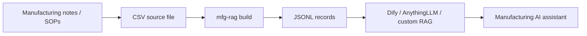
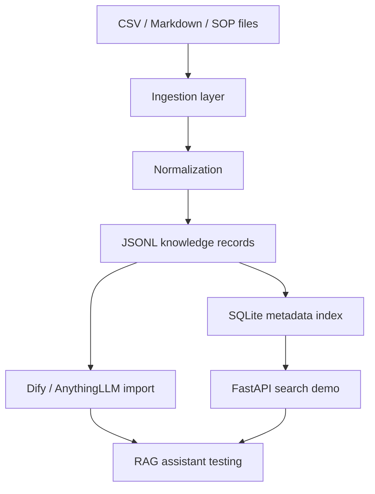

# Architecture

Manufacturing RAG Starter is designed as a small and transparent pipeline rather than a complex platform.

## Design goals

- Keep the first version easy to understand.
- Avoid mandatory external services.
- Make generated knowledge records portable across Dify, AnythingLLM, Open WebUI, FastAPI services, and other RAG tools.
- Preserve manufacturing context such as ERP, MES, WMS, APS, BOM, MRP, quality inspection, delivery, and finance analysis.

## Current pipeline

## Current components

### 1. Source data

The current starter format is CSV:

- `id`
- `title`
- `scenario`
- `source_type`
- `tags`
- `content`

This structure keeps the examples simple and makes it easy to edit records in a spreadsheet.

### 2. CLI builder

The Python CLI converts CSV records into JSONL records with:

- `id`
- `title`
- `scenario`
- `source_type`
- `tags`
- `text`
- `metadata`

The `text` field is optimized for direct ingestion by knowledge-base tools.

### 3. Examples

The repository includes sample manufacturing records covering:

- ERP to MES order flow;
- BOM version changes;
- WMS inventory exceptions;
- quality inspection exceptions;
- finance operation analysis.

### 4. Documentation

The documentation focuses on business workflow understanding, not only code usage. This is important because manufacturing AI projects usually involve implementation consultants, process owners, and IT teams.

## Planned architecture

## Non-goals

This project is not intended to replace ERP, MES, WMS, APS, or a full document management system. It is a starter kit for preparing clean knowledge assets and testing manufacturing AI assistant workflows.

## Security and privacy notes

Do not commit customer-sensitive information, private contracts, production data, employee personal data, credentials, or proprietary implementation documents. Use synthetic or anonymized examples when contributing.
